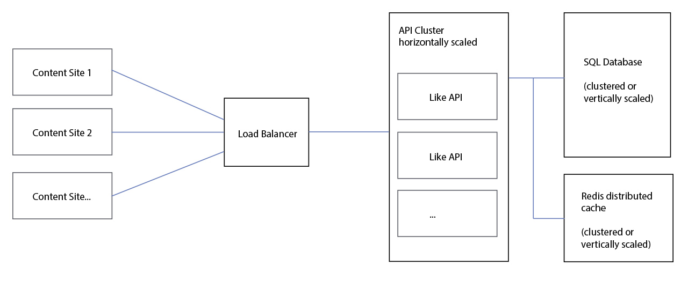
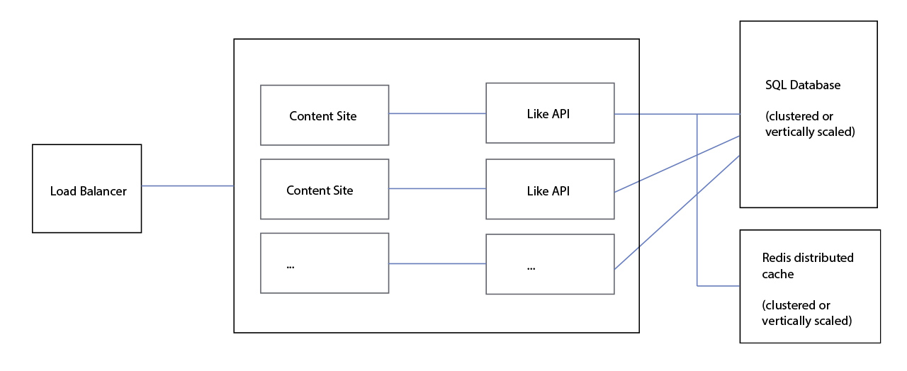

## Like button Feature coding challenge

### Testing considerations
These items would not be part of a production scenario. They are there to facilitate local testing
- Containers are orchestrated with docker compose only
- Port 80 of the API container is exposed
- Port 5432 of the database container is exposed
- An endpoint has been added that generates arbitrarily valid tokens (/api/token/generate-token)
- there are 2 static htmls to test the flow with valid tokens and without a token, for the swagger that allows you to test all endpoints individually.
- To avoid downloading an unecessary Redis image for the tests, the distributed memory cache will only use the host machine's memory. In the services, an abstraction was used so if a backplate is configured it will not be necessary to make code changes.

### Architecture possibilities (simplified)
#### In cases where the customer who is going to consume the addiction does not own the service

In this scenario, the service must have its own load balancer. The API would be clustered and scaled horizontally as needed to maintain high availability

#### In cases where the customer is the owner of the service and external access to the API is not allowed

In this scenario, horizontally scaling only the API would not be enough, since the ability to render the button would also depend on the requester's ability to render its own content. It would be more appropriate to create deployments in pairs of content provider and like functionality, with the load balancer before these deployments

### How to initialize
It is necessary to have the docker installed. In the solution folder, run a **"docker-compose up"** or open the solution in Visual Studio and run the docker compose project. Make sure that no other programs are using port 80 locally. 

### How to use
#### Testing endpoints
considering that you'll be running locally, the swagger address will be:
http://localhost/swagger/

#### Testing with the provided sample pages
for anonymous users (only counting):
http://localhost/scripts/sample_anonymous.html

With token (allowed to like)
http://localhost/scripts/sample.html

#### Including in other pages
include the block below on any page that should render the button and the count of likes. Anonymous users can receive the count, users who have a valid token can like.
```javascript
<div id="like"></div>
<script type="text/javascript" src="likebutton.js"></script>
<script>
    //Anonymous
    function buildLike() {
        likeButton(document.getElementById("like"));
    }
    //with token
    function buildLike() {
        likeButton(document.getElementById("like"), "[USER_TOKEN]");
    }
</script>
```
buildLike() should called when the document is ready.

### About performance and cache
Counting likes is probably a much more frequent operation than liking, so it makes sense to use a cache system for counting as long as it is highly segmented. Currently the cache is made by storing the urls as a key and only the total number of likes as a value. The counter will only consult the database if it does not find the key in cache, and having a result will store the value for the key in cache. New likes will invalidate the cache for just that url.
Using redis as a provider for distributed cache it is possible to obtain a performance considerably superior to the alternative of making new queries in the database for every request.

On the database side, it is possible to retrieve likes by url, which is faster for counting. It is also possible to retrieve urls liked by user, which is faster for checking url already liked